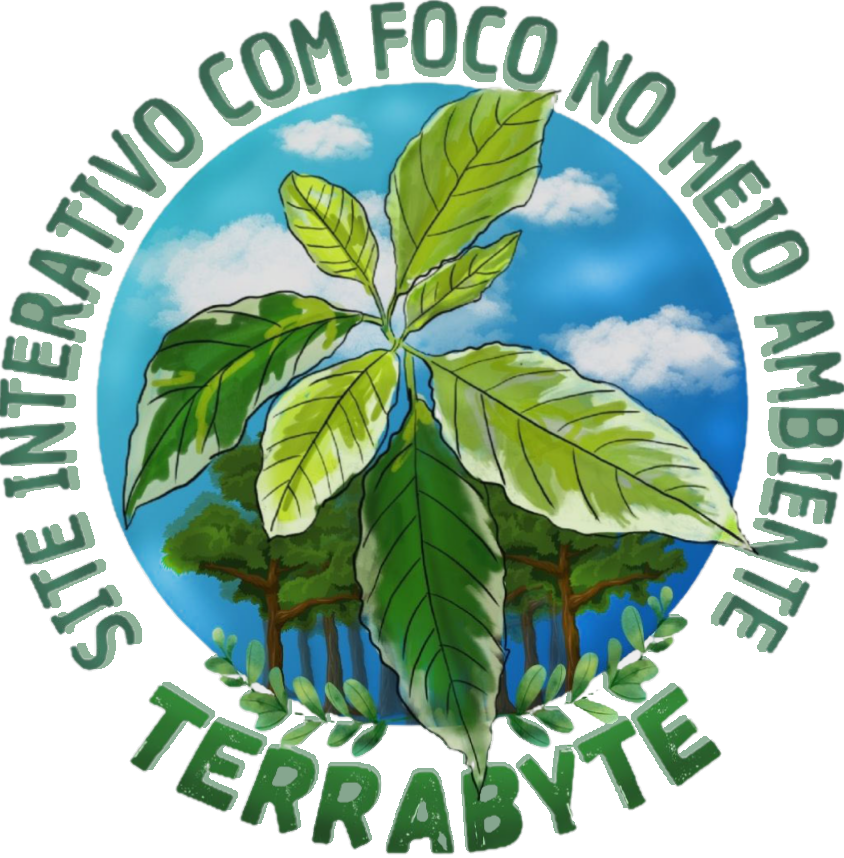
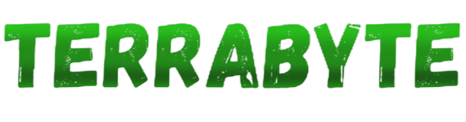

Este site interativo com foco na conscientização ambiental busca educar os usuários por meio de um quiz interativo que aborda questões ambientais, como poluição, conservação de recursos naturais e biodiversidade, e sugere boas práticas para a preservação do meio ambiente através de informações educativas e interativas, o objetivo é estimular o conhecimento e incentivar ações sustentáveis, promovendo um engajamento ativo do público na causa ambiental.

## 🛠 Funcionalidades 🛠

- *Realizar Quizzes* : Responda à perguntas sobre o meio ambiente e receba sugestões de como conservá-lo!
- *Faça parte de ONGS ou Doações* : Realize ações para ajudar na preservação ambiental.
- *Notícias* : Descubra notícias acerca da preservação ambiental e meio-ambiente.
- *Mapa Interativo de Queimadas* : Use um mapa interativo para obter informações sobre queimadas ao redor do globo!

## 🚀 Como utilizar 🚀

```bash
1 git clone https://github.com/Slyyd/site-meio-ambiente.git
2 cd site-meio-ambiente
```


## Pré-requisitos:

- Um navegador moderno (Google Chrome, Firefox, Edge, etc.).
- Conhecimentos básicos de HTML, CSS e JavaScript (opcional, para personalização).

## 📂 Estrutura do Projeto 📂
```bash
├── docs/              # Pasta principal do projeto
├─── index.html        # Página com as questões do projeto
├─── home.html         # Página Home
├─── sobre.html        # Página com Informações e Notícias
├─── mapa.html         # Página do Mapa de Queimadas
├─── questions.json    # Arquivo com as questões do quiz
├── css/               # Arquivos de Folhas de Estilo
│   ├── home.css       
│   ├── sobre.css      
│   └── mapa.css       
├── img/               # Imagens e ícones usados no projeto
│   ├── amigo-secreto.png 
│   ├── amigo-secreto.png 
│   └── play_circle_outline.png 
├── js/                # Arquivos JavaScript
│   ├──  home.js
│   ├──  mapa.js 
│   ├──  noticias.js 
│   └──  sobre.js
├── LICENSE            # Licença do Projeto
└── README.md          # Readme com as informações do projeto
```

## 💻 Tecnologias Utilizadas 💻


## 📄 Licença
Este projeto está sob a licença APACHE 2.0. Veja o arquivo LICENSE para mais detalhes.

## APIs Utilizadas


## 🎉 Agradecimentos 

- Fontes Google Fonts:
- Imagens:
- APIs:
